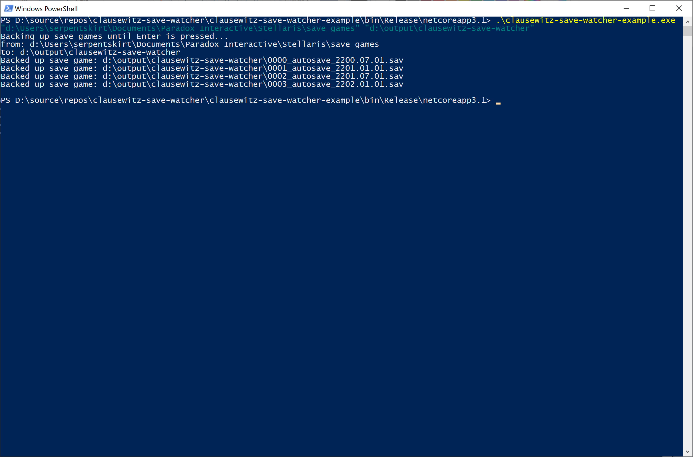

# clausewitz-save-watcher
A simple class that asyncronously backs up changed files in **source** directory and its sub-directories. Any changed file is copied to **target** directory with four leading zeros count prefix (e.g. *0000_file.name*, *0001_another_file.name* etc.).

## How to use the class
An example project is included to demonstrate how to use this class.

## How to use example project application
The example project builds stand-alone application. Provide **source** and **target** paths as apllication arguments:

